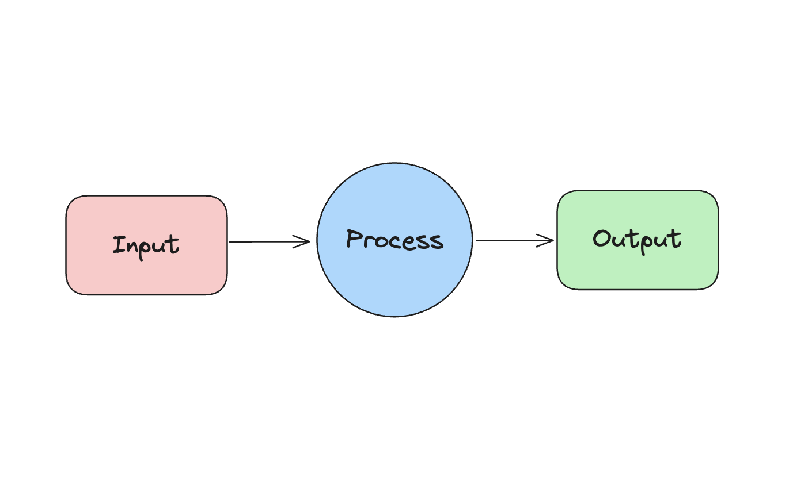
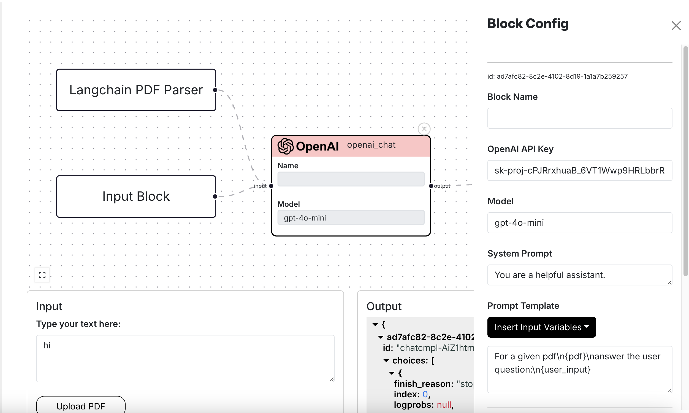

Blocks are the main components that the user see's in the drawing board. Blocks can also be thought
of as nodes in a graph, and these nodes implements a some specific function. 


There are three kinds of blocks, which are as follows:
- Input Blocks
- Process Blocks
- Output Blocks

These blocks are split up in this fashion because in **otto-m8**, the project adheres to a [Input-Process-Output](https://en.wikipedia.org/wiki/IPO_model)
(IPO) paradigm. Like any program, there is a input which goes through some process to produce an output. 




### Input Blocks
Input blocks are blocks that are responsible for handling user input. Any sort of program that handles user input
will go in this category. The most basic form of block in this category is the Text Block(alias Input Block), which
takes in text based inputs. The other kinds of input blocks are pdf loaders which, on a high level, are file based 
inputs. 

### Process Blocks
Process Blocks are essentially anything and everything that can be integrated and implemented within the otto-m8 library. Since
we follow the IPO model, processes are responsible for transforming the input to an output. Although primarily it was designed
to hold ML blocks, ML blocks alone would not make workflows amount to much if other functionalities aren't available. Therefore,
with otto-m8 process blocks can either implement ML based functions like Huggingface, OpenAI, etc, it can also
implement a Gmail API integration, Slack integration, (the sky is the limit integration) etc.

### Output Blocks
The Output Blocks are blocks that represent the output that the user will see once the workflow runs. There can ever be only 1
Output Block per workflow. There are two kinds of Output Blocks:
1. **Output Block**: This is the block responsible for displaying the output of the workflow. When the user runs a workflow via a 
REST API call, the presence of the output block will allow the users to see the workflow output.
2. **Chat Output**: This is an extension of the otto-m8 library that provides users a chat interface when they have a *large language
model in the last block prior to the Output*.

## Implementation

Every block within the otto-m8 ecosystem implements a program or an integration with third party libraries. You can simply see it
as an implementation of each block. For the purpose of this project, implementations are divided into two camps – Tasks and Integrations.

### Tasks
Tasks are mostly implementations of ML based workloads and blocks that are native to the platform – Input and Output Blocks.

### Integrations
As the name suggests, Integrations are anything that is to be integrated with the ML based tasks. One important thing to note
here is that, although, most ML based "Tasks" are integrations of some sort within the otto-m8 library, the integrations within
the context of Blocks are meant to be interpreted as integrations to Tasks. 

For example, consider a program where we use the OpenAI library and its function calling feature. Here, in the context of otto-m8 
library, OpenAI itself is an integration; but in the context of Blocks, the integration of OpenAI will be grouped under Tasks. 
Now for function calling, when we use the HTTP Block to allow the OpenAI library to call some HTTPs endpoint for function calling, 
the HTTP Block will be grouped under Integrations since it is integrating with a Task Block, which is the OpenAI block.

On a high level, a implementation looks as follows:
```python
from abc import abstractmethod, ABC

class BaseImplementation(ABC):
    """Base class for all implementations. An implementation is a class that implements a
    library(third party integrations) for a Block."""
    
    @abstractmethod
    def run(self):
        pass
```

Every implementation will generally run the core function of some library, and therefore, here's an example
of how to apply it to implementing Huggingface's pipeline abstraction:
```python
import io
import json
from PIL import Image
from transformers import (
    pipeline
)
from implementations.base import BaseImplementation
from integrations.hugging_face.hugging_face_api import HuggingFaceApi
from core.types import InputType

class HuggingFaceModelCard(BaseImplementation):
    """ 
    Implementation of Hugging Face Pipeline abstraction for single
    input models. 
    """
    def __init__(self, run_config:dict) -> None:
        self.run_config = run_config
        self.model_card = run_config.get('model_card')
        self.input_type = run_config.get('input_type')
        self.get_huggingface_pipeline_config()
        self.pipeline = pipeline(self.pipeline_tag, model=self.model_card)
        
    
    def run(self, input_:dict=None) ->dict:
        # Since this is unimodal, we only will ever take 1 input.
        ...
        results = self.pipeline(input_)
...
```

## Run Configuration

When interacting with Otto-m8 and its Templates, you'll notice the term `run_config` being used. A `run_config`,
short for Run Configuration, is any user related configurations that dictate how a Block will run. For instance:



For a OpenAI Block, when the user configures things such as the key, model, prompt template, etc. these make up a 
Block's run configuration:

```json
{
    "model": "gpt-4o-mini",
    "pass_input_to_output": false,
    "system": "You are a helpful assistant.",
    "openai_api_key": "sk-proj-cPJRrxhuaB_6VT1Wwp9HR",
    "prompt_template": "For a given pdf\\n{pdf}\\nanswer the user question:\\n{user_input}"
},
```