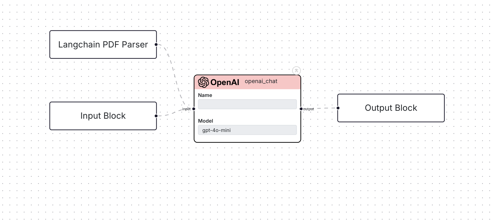

The Template is a JSON file which serves as a blueprint for a workflow, the resources
that need to be run and how they'll be run. Otto-m8's UI lets users drag and drop Blocks, configure
them and interconnect them with other blocks. While the UI enables users to understand what is going on,
we still need to instruct backend on how and what to run. To do this, we need a way to map the
frontend UI elements and its configurations into a format that the backend will understand.

## Example Template

For instance, for the following workflow, where the user configured a Langchain PDF Parser and a Text Input, connected
with OpenAI Chat, the UI would look something like:

and, the template will look as follows:
```json
{
  "workflow_name": "openai_test",
  "input": [
    {
      "name": "Input_Block",
      "block_type": "input",
      "connections": [
        "process.ad7afc82-8c2e-4102-8d19-1a1a7b259257"
      ],
      "run_config": {},
      "implementation": null,
      "custom_name": "user_input",
      "payload": null,
      "input_type": "text",
      "process_metadata": {
        "core_block_type": "text_input",
        "process_type": "task"
      }
    },
    {
      "name": "Langchain_PDF_Parser",
      "block_type": "input",
      "connections": [
        "process.ad7afc82-8c2e-4102-8d19-1a1a7b259257"
      ],
      "run_config": {},
      "implementation": null,
      "custom_name": "pdf",
      "payload": null,
      "input_type": "file",
      "process_metadata": {
        "core_block_type": "langchain_pdf_loader",
        "process_type": "task",
        "files_to_accept": "application/pdf",
        "button_text": "Upload PDF"
      }
    }
  ],
  "process": [
    {
      "name": "ad7afc82-8c2e-4102-8d19-1a1a7b259257",
      "block_type": "process",
      "connections": [
        "output.Output_Block"
      ],
      "run_config": {
        "model": "gpt-4o-mini",
        "pass_input_to_output": false,
        "system": "You are a helpful assistant.",
        "openai_api_key": "sk-proj-cPJRrxhuaB_6VT1Ww",
        "prompt_template": "For a given pdf\\n{pdf}\\nanswer the user question:\\n{user_input}"
      },
      "implementation": null,
      "custom_name": "",
      "process_metadata": {
        "core_block_type": "openai_chat",
        "process_type": "task"
      }
    }
  ],
  "output": [
    {
      "name": "Output_Block",
      "block_type": "output",
      "connections": [],
      "run_config": {},
      "implementation": null
    }
  ],
  "version": 1
}
```

## Building Blocks
To sum up concepts from the previous section on [Blocks](/docs/conceptual-guide/blocks), and 
[Workflows](/docs/conceptual-guide/workflow), a Template is a textual representation of all
the resources needed to run a workflow.

### Block
```python
class Block(BaseModel, extra = 'forbid', arbitrary_types_allowed = True):
    name: str
    block_type: str = 'simple_block'
    connections: list[str] = Field(description="List of connections to other blocks in the model", default=[])
    run_config: dict = Field(description="Configuration for the run", default=None)
    implementation: Union[BaseImplementation, None] = Field(description="The implementation of the block", default=None)
```

### Input Block
```python
class InputBlock(Block):
    custom_name: str = 'user_input'
    block_type: str = 'input'
    payload: Union[str, None] = None
    # The input type of the block determines the type of the input in the run config that will be passed to a model.
    input_type: str = 'text'
    process_metadata: dict = {}
```

### Process Block
```python
class ProcessBlock(Block):
    custom_name: str
    block_type: str = 'process'
    process_metadata: dict = {}
```

### Output Block
```python
class OutputBlock(Block):
    block_type: str = 'output'
```

### Workflow Template
```python
class WorkflowTemplate(BaseModel, extra='forbid'):
    workflow_name: str
    input: List[InputBlock]
    process: List[ProcessBlock]
    output: List[OutputBlock]
    version: float = 1.0
```