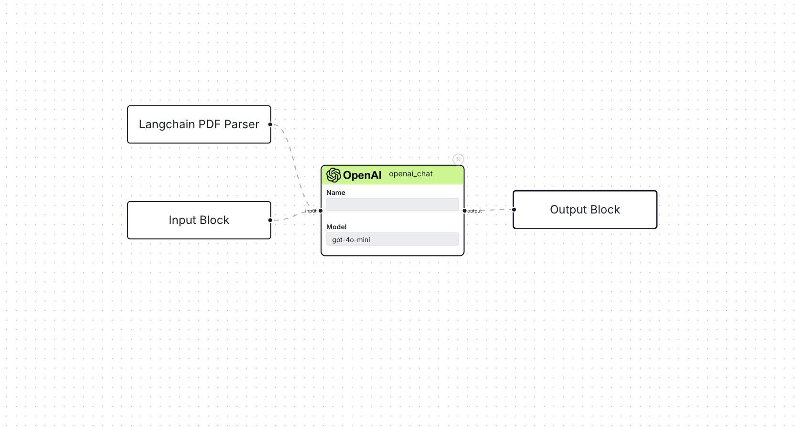

## Workflow

A workflow is what the user creates using Blocks and interconnecting them. For the user this means
creating their AI/ML workload by interweaving different models and integrations together, and deploying
it as a REST API. 

At its core, it's simply a graph that consists of nodes(the Blocks) and edges(the connections). The
workflow is responsible for initializing resources and running all the blocks's implementation during
an execution or user run. To learn more about how everything's working, check this [blog](https://medium.com/@farhanishraq82/building-a-no-code-platform-and-the-bfs-algorithm-6555f2bac3e5) out.
A workflow depends on the Template, and together they make a deployable.

## Deployable
When a user creates a workflow, under the hood a Docker image is created. The image contains the
template and the workflow module, interfaced via a FastAPI server. This server is the entry point for
all user interaction with the live workflow.

import Deployable from './imgs/deployable.png';

</img>

A visual of all the components of a deployable.

What this means is that, this image can be used to run a Docker container to interact with the user workflow.
And as with every Docker container, it can be deployed on various cloud services.

### Endpoints that are available
| endpoint | description |
-----------|--------------
|    POST `/workflow_run`      |   Main endpoint to hit to interact with the workflow. This will only return output for any Output Block available.          |
|    POST  `/workflow_run/run_chat`     |     This endpoint is used by the Chat Interface and is only available if a Chat Output Block is available.        |
|    GET `/workflow_run/get_chat_history`     |     If a Chat Output Block is present, querying this endpoint will return all the chat history.        |
|    DELETE `/workflow_run/clear_chat_history`   | If a Chat Output Block is present, this endpoint will clear any chat history.                         |

For most parts, the fist endpoint is the endpoint that the user will be using since the other one's were built specifically
for the Chat Interface.