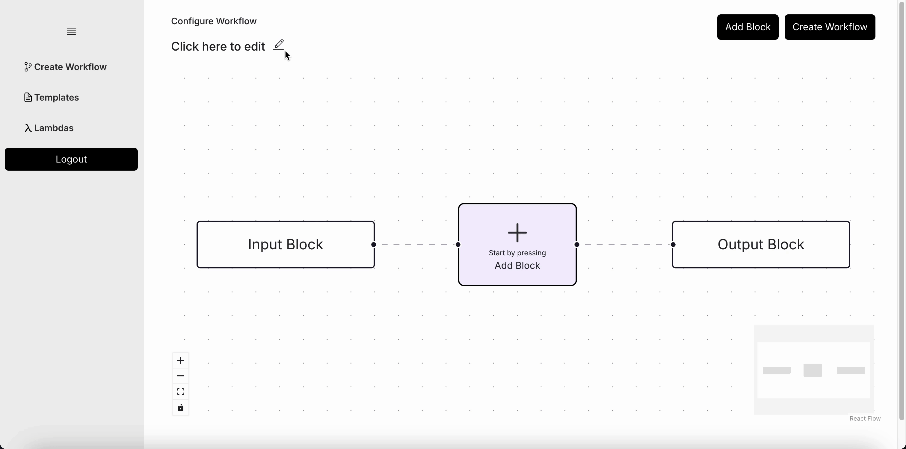
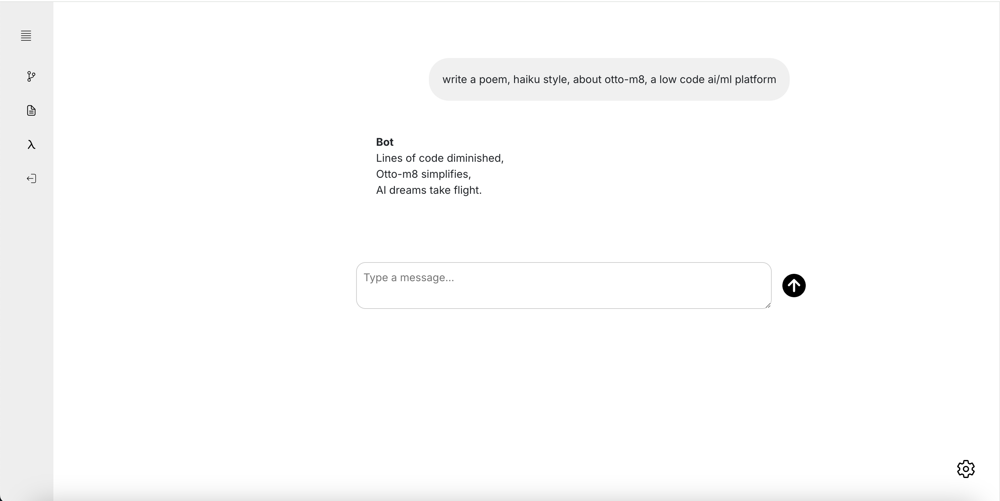

This tutorial is demonstration on how to use **otto-m8**, by building a simple chatbot
powered by OpenAI API. 

## 1. Name your Workflow

The first step would be to name your workflow. Make sure its a **unique name** for each workflow
you create, as the name will form the basis of the Docker image that will be created.



## 2. Select the Open AI Chat Block

Now that you've named your Workflow, you'll need to select the OpenAI Chat Completion Block 
from the **Add Block** button. Once your block appears on the screen, configure the block.
For OpenAI, you'll need an OpenAI API [key](https://help.openai.com/en/articles/4936850-where-do-i-find-my-openai-api-key).


## 3. Connect the blocks

When you connect a block's output to another block's input, you're essentially allowing the blocks
to pass data between each other. Therefore, without passing the input block to the chat block, you won't see
the block's name show up. But once you do, you can then use that in the prompt template.


In this example, we're simply gonna pass the user input as is via `{user_input}` but you could essentially
use the **Prompt Template** as a way to add custom prompts.

## 4. Add a Chat Output Block

Adding a **Chat Output Block** is optional. Do so if you plan to use the Chat UI, or else, the Output Block
will be enough if you plan to use it as an API.


## 5. Interact

Once deployed, you can use the Chat UI to chat with your workflow.



To use this workflow as an API, you'll need to know the names of the Input Block. This
could be found when you click on the Input Block, within the Block Config side bar. 
<br/>

import blockConfigImg from './blockname.png';

</img>


The last thing you'd need to know is the endpoint for your workflow, which can be found
on the **Templates** page on the left nav bar. If it's your first workflow, then it should
look something like this: `http://localhost:8001/workflow_run`. With that, write the following code,
and run:

```python showLineNumbers
import requests
import json

deployment_url = "http://localhost:8001/workflow_run"
payload = {
   # Based on the name you found, replace spaces with an underscore.
   "Input_Block": "Write a poem, haiku style, about otto-m8, a low code automation platform"
}

request = requests.post(
    deployment_url, 
    json={"data": payload}
)
response = request.json()['message']

response = json.loads(response)
print(response)
```

